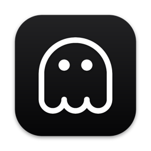

<div align="center">



# GhostQuill

**Typing is over. Just speak it.**

[](https://github.com/szaycev/ghostquill-releases/releases/latest)
[](#installation)

**[Download for macOS](https://github.com/szaycev/ghostquill-releases/releases/latest/download/GhostQuill.dmg)** · [ghostquill.app](https://ghostquill.app) · [Release notes](../../releases) · [Privacy](https://ghostquill.app/privacy)

</div>

GhostQuill is a free menu-bar app for push-to-talk voice typing on macOS: hold a shortcut, speak, release — and the transcript is typed straight into whatever app you're working in. Transcription runs entirely on your Mac, powered by [whisper.cpp](https://github.com/ggml-org/whisper.cpp). Audio and transcripts never leave the machine.

This repository is GhostQuill's public release channel: downloads, the update feed the app checks, and release notes. The app itself is closed-source.

## Highlights

- **Push-to-talk.** Hold your shortcut, speak, release — the text lands in the focused field of any app.
- **Fully on-device.** Speech recognition runs locally with whisper.cpp — your audio and transcripts never leave the Mac.
- **Your choice of model.** Pick the Whisper model that fits your Mac, from fastest to most accurate — downloaded on demand.
- **Scratchpad.** Dictating with no text field focused? Your words are caught in a scratchpad that doubles as a dictation window.
- **Guided onboarding.** Permissions, model download, and shortcut setup in a couple of minutes.
- **Automatic updates.** Signed updates install quietly in the background.

## Privacy

Dictation happens entirely on your Mac: audio is captured only while you hold the shortcut, processed in memory, and never sent anywhere — there are no accounts and no cloud speech service. To improve the app, GhostQuill shares a small set of anonymous, content-free diagnostics (crash reports and coarse usage events — never your voice, never your text). Model downloads and update checks are the only other network traffic. Full details: [ghostquill.app/privacy](https://ghostquill.app/privacy).

## Installation

1. Download [`GhostQuill.dmg`](https://github.com/szaycev/ghostquill-releases/releases/latest/download/GhostQuill.dmg) — or pick a specific version on the [Releases](../../releases) page.
2. Open the image and drag **GhostQuill** into **Applications**.
3. Launch it. Onboarding walks you through the two permissions the app needs:
   - **Microphone** — to hear you.
   - **Accessibility** — to type the transcript into other apps.

**Requirements:** macOS 15 (Sequoia) or later · Apple Silicon

## Updates

GhostQuill keeps itself up to date with [Sparkle](https://sparkle-project.org/). The app checks the feed published in this repository:

```
https://raw.githubusercontent.com/szaycev/ghostquill-releases/main/appcast.xml
```

Notes for every version live in [`notes/`](notes) and on the [Releases](../../releases) page.

## Security and release integrity

You don't have to take our word for what's in a binary:

- **Signed and notarized.** Every build is signed with an Apple Developer ID certificate and notarized by Apple. Verify it yourself after installing:

  ```console
  $ spctl -a -vv /Applications/GhostQuill.app
  GhostQuill.app: accepted
  source=Notarized Developer ID
  origin=Developer ID Application: Sergey Zaycev (M7UG84UYVG)
  ```

- **Signed updates.** Every update archive is additionally signed with an EdDSA (Ed25519) key, and the app only installs updates whose signature matches the public key it ships with:

  ```
  7Jya4jR8KR1v5XDAcIPGAF8PoJIz0BtafQeF3tB+cJw=
  ```

- **No hand-edited releases.** Everything here — feed entries, notes, binaries — is produced by GhostQuill's release pipeline.

## What's in this repository

| Path | Purpose |
|------|---------|
| [`appcast.xml`](appcast.xml) | The Sparkle update feed the app checks |
| [`notes/`](notes) | Release notes, one fragment per version, embedded into the feed |
| [Releases](../../releases) | Builds, one tag per version: a `.dmg` for first installs and a `.zip` consumed by the in-app updater |

## Feedback and support

Found a bug, or wish GhostQuill did something it doesn't? [Open an issue](../../issues) — reports and ideas are welcome.

---

<div align="center">
<sub>© 2026 GhostQuill · <a href="https://ghostquill.app/terms">Terms</a> · <a href="https://ghostquill.app/privacy">Privacy</a></sub>
</div>
